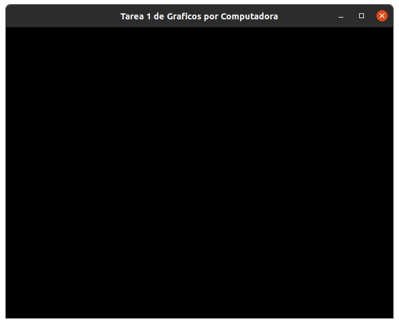
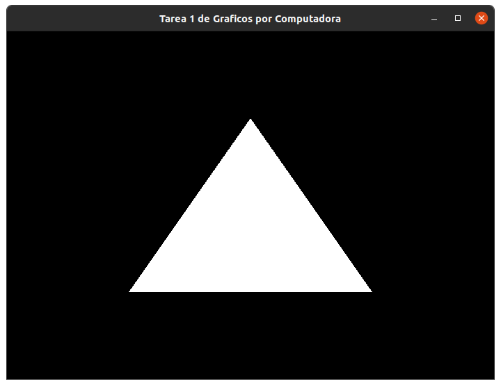
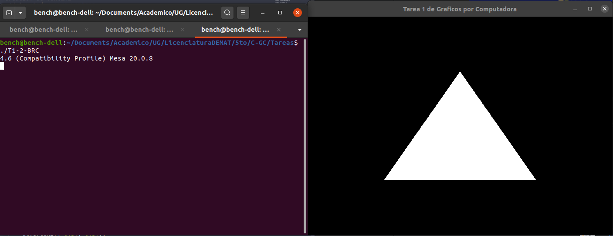

# Tarea 1
#### Graficos por Computadora

La __tarea 1__ implica seguir el tutorial de __OpenGL__ de 
[Cherno](https://www.youtube.com/channel/UCQ-W1KE9EYfdxhL6S4twUNw), 
especificamente los videos 
[1](https://www.youtube.com/watch?v=W3gAzLwfIP0),
[2](https://www.youtube.com/watch?v=OR4fNpBjmq8) y 
[3](https://www.youtube.com/watch?v=H2E3yO0J7TM).


## Video 1. Introducción.

En esta serie de videos se tratara de ser _multiplataforma_, se programara con _C++_ y únicamente se revisara el material para ver _(como y porque)_ programar los __shaders__.

> El __shader__ es un programa que corre en la _GPU_.

__OpenGl__ es una _API_ para trabajar con gráficos; dentro de otras cosas, nos  permite trabajar especificamente con la _GPU_ de la computadora. Es importante notar que nos es una _libreria_ o _framework_.

Cuando usemos __OpenGL__ lo que se termina ejecutando puede no ser lo mismo en todas las computadoras, esto es porque las implementaciones de __OpenGL__ pueden variar dependiendo de del fabricante de la _GPU_. Aumque por otro lado, __OpenGL__ es multiplataforma, esto quiere decir que la _API_ esta disponible en los principales sistemas operativos y aunque las implementaciones no son iguales, las funciones disponibles en la _API_ si lo son.

En terminos de complejidad __OpenGL__ no es el sistema ideal para utilizar en produccion aunque, dado que es multiplataforma, tiene muchas funciones básicas y esta instalado por deault en la mayoría de los sistemas, si es ideal para aprender.

### Modern OpenGL

Actualmente hay dos versiones de _OpenGL_, el __clásico OpenGL__ y __Modern OpenGL__. En pocas palabras el _OpenGL_ __moderno__ tiene funciones más primitivas que el __clásico__; esto es porque los programadores, en ciertas ocasiones, necesitan más control sobre los elementos para hacer gráficos. Especificamente la diferencia entre las versiones es la manera en que se trabaja con los __shaders__.


## Video 2. Configuración del proyecto.

### Ventanas

Para trabajar con las ventanas (dado que queremos que este código sea multiplataforma) usaremos la ___libreria_ GLFW__. Esta es una libreria ligera que nos permitira crear una ventana, crear contexto un __OpenGL__ y tener acceso a funciones basicas como _input_.

#### Pruebas

Al compilar los programas que dependan de __GLFW__ es imporante ligar manualmente las librerias con el compilador (`-lglfw` que liga a __GLFW__ y `-lGL` para ligar __OpenGL__) para que no marque errores. Y despues de compilar el [codigo fuente](./T1-0-BRC-GLFW_example.cpp) con 
```console
$ g++ T1-0-BRC-GLFW_example.cpp -lglfw -lGL -o T1-0-BRC
```
obtenemos el [ejecutable](./T1-0-BRC) el cual muestra la siguiente ventana.



### Inicio OpenGL

Ahora, para la primera prueba de __OpenGL__ usaremos la versión clásica, dado que es más facil e intuitiva de usar. Primero hay que iniciar un espacio de __OpenGL__ y con `GL_TRIANGLES` le indicamos lo que queremos construir
```c++ 
glBegin( GL_TRIANGLES );
```
luego necesitamos indicar los vertices del triangulo
```c++
glVertex2f(-0.5f,-0.5f);
glVertex2f( 0.0f, 0.5f);
glVertex2f( 0.5f,-0.5f);
```
y por ultimo debemos indicar el fin de la figura
```c++
glEnd();
```

#### Pruebas

Entonces compilamos el [nuevo codigo](./T1-1-BRC-OpenGL.cpp) 
```console
$ g++ T1-1-BRC-OpenGL.cpp -lglfw -lGL -o T1-1-BRC
```
lo que despues de [ejecutar](./T1-1-BRC) muestra




## Video 3. 

Ahora hay que empezar a trabajar mejor con __modern OpenGL__. Para esto usaremos la libreria __GLEW__ que es una libreria de código abierto multiplataforma para _C/C++_.

#### Pruebas

Antes de compilar el [codigo]() es necesario ligar la nueva libreria (`-lGLEW`) para que no haya errores
```console
$ g++ T1-2-BRC-GLEW.cpp -lglfw -lGL -lGLEW -o T1-2-BRC
```




## Extra

Por ultimo trataremos de realizar el mismo codigo mediante las librerias de __Python__ correspondientes. 

__GLFW__ si tienene su implementacion correspondiente en __Python__, y las funciones tienen el mismo nombre. Los codigos se trasladaron exitosamente [aqui ](T1-0-BRC-GLFW.py)

Respecto a __GLEW__ unicamente hay un paquete que unicamente esta disponible para __Python 2__; sin embargo, es posible usar __modern OpenGL__ con su respectiva libreria.
