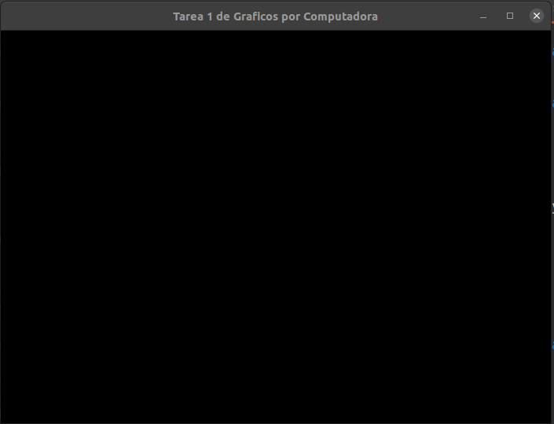
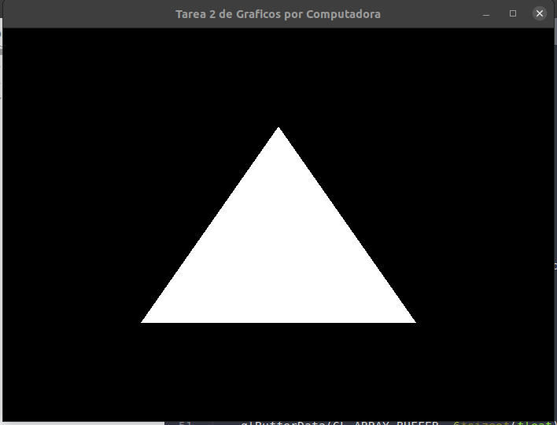
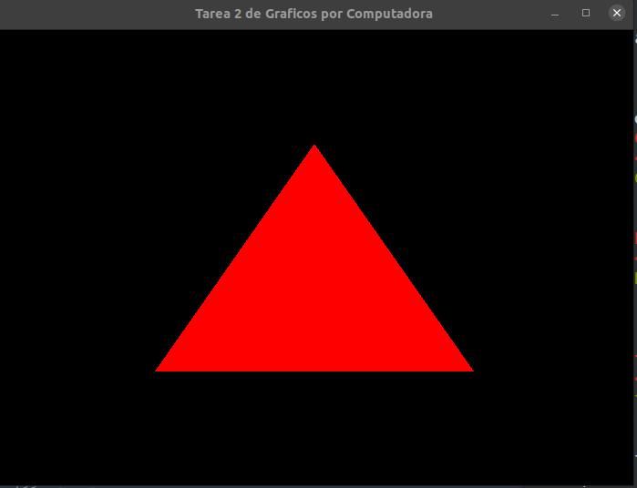

# Tarea 2
#### Graficos por Computadora

La __tarea 2__ ver los tutoriales del 4 al 8 de __OpenGL__ creados por 
[Cherno](https://www.youtube.com/channel/UCQ-W1KE9EYfdxhL6S4twUNw), 
igual a la tarea anterior, es importante escribir el codigo de los tutoriales.

Como evidencias es indispensable mandar los códigos y el resultado de los mismos de los videos 7 y 8.


## Video 4. Buffer de Vertices y Dibujando un triangulo in OpenGL

> Vertex Buffer: es el buffer que maneja internamente OpenGL para guardar las instrucciones y la informacion para mandar a la GPu, o el CPU, en su defecto.


Podemos resumir le trabajo de openGL en 
 1. dame datos, 
 2. dime como dibujar esos datos
 3. dime como calcular estos datos

De manera un poco mas formal, es importante notar que OpenGl funciona como una maquina de estados. Cada una de las cosas que creemos aqui, recivira un _ID unico_, por lo que para usar cualquier cosa, debemos conocer su _ID_.

### Codigo

De maner que, para __crear un buffer__ usaremos
```cpp
glGenBuffers(n, pointer)
```
al cual le debemos de pasar la cantidad de buffers *n* a crear y un apuntador para guardar el _ID_ del objeto.

Luego para __seleccionar ese buffer__, dentro de OpenGL, se usa la operacion _Bind_, la cual se llama con
```cpp
glBindBuffer(tipo, ID)
```
donde seleccionaremos el tipo del bufer *tipo* y el *ID* del objeto con el que se planea trabajar.

Por ultimo es necesario __ingresar informacion en el buffer__, para eso usamos la funcion
```cpp
glBufferData(tipo, sizeOfData, data, tipoUso)
```
Al cual se le tiene que pasar el tipo de buffer que se esta usando, el tamaño de la información a ingresar, la información, y el tipo de uso. Respecto al tipo de uso que le daremos al buffer, tenemos las opciones
 - `GL_STATIC_DRAW`, para modificar una vez y usar muchas
 - `GL_DYNAMIC_DRAW`, para modificar constantemente y usar constantemente
 - `GL_STREM_DRAW`, para modificar una vez y usar pocas veces

se recomienda usar el que se acerca mas al uso actual para que se ejecute lo mas optimo posible. `DRAW` tambien es intercambiable por `READ` o `COPY`, que se usan como seria esperado.

Ademas es necesario decirla a OpenGL como interpretar esta informacion, pero esto se explica mas adelante.

#### Resultado

Despues de ejecutar y compilar el [codigo](./T2-4-Buffer.cpp), con
```console
$ g++ T2-4-Buffer.cpp -lglfw -lGL -lGLEW -o T2-4-BRC
```
obtenemos la siguiente pantalla



Aun falta trabajo xD


## Video 5. Atributos de Vertices y Capas en OpenGL

En estos ejemplos debemos de tener en cuenta que los _vertex_ no representan solo posiciones. En OpenGL los _vertex_ guardan mucha informacion, tal como posicion, color, textura, binomios, tangentes, entre otros.

> Siempre hay que tener cuidado de que estemos trabajando sobre el buffer deseado y, en caso de que queramos mostrar esa información, que ese buffer este seleccionado con `Bind`

### Codigo

Primero hay que definir los datos de _vertex_ y la manera de leerlos, para eso se utiliza la funcion
```cpp
glVertexAttribPointer()
```
para entender mejor esta funcion es mejor leer la respectiva
[documentacion](http://docs.gl/gl3/glVertexAttribPointer)

Luego de crear el atributo, es necesario activarlo, esto se hace con
```cpp
glEnableVertexAttribArray()
```
que recibe el _ID_ del atributo generico que queremos activar, el cual se crea con el comando anterior (al igual que el _ID_). De manera similar funciona la funcion para desactivar
```cpp
glDisableVertexAttribArray()
```

#### Resultados



## Video 6. Como funcionan los Shaders en openGL

> __Shader__ Programa que corre en la _GPU_

La definicion anterior es una simplificaci\'on de lo que hace un shader. Algunas GPU's tran incluidos shaders por defecto.

El Shader, _especificamente_ en _Graficos por Computadora_, es el programa encargdo de definir como se visualizara alg\'un punto. De la misma manera, existen dos __tipos de shaders__ que se suelen usar, los __VertexShader__ y los __PixelShader__ (FragmentShader); estos unicamente son los m\'as utilizados en _CG_, pero no son los unicos que existen.

Estos aparecen en el flujo de ejecucion de la funcion `draw`, despues de que esta sea llamada se ejecuta el _VertexShader_, luego el _PixelShader_ y por ultimo se dibuja algo en pantalla.

Los __VertexShader__ se encarga de obtener informacion de cada uno de los vertex declarados en el programa, para despues decirle al programa en que _posicion_ de la pantalla debe trabajar y pasar el resto dela informacion al flujo de ejecicion.
Y el __PixelShader__ debe correr una vez por cada uno de los pixeles que queremos actualizar en la pantalla, despues de esto _define el color_ que este pixel debe adoptar en funcion de la informacion del programa; hay que tener __cuidado__ con la cantidad de calculos que se realizan en este _shader_.


## Video 7. Escribiendo un Shader

### Codigo

#### Resultado



## Video 8. Como manejar los Shaders

